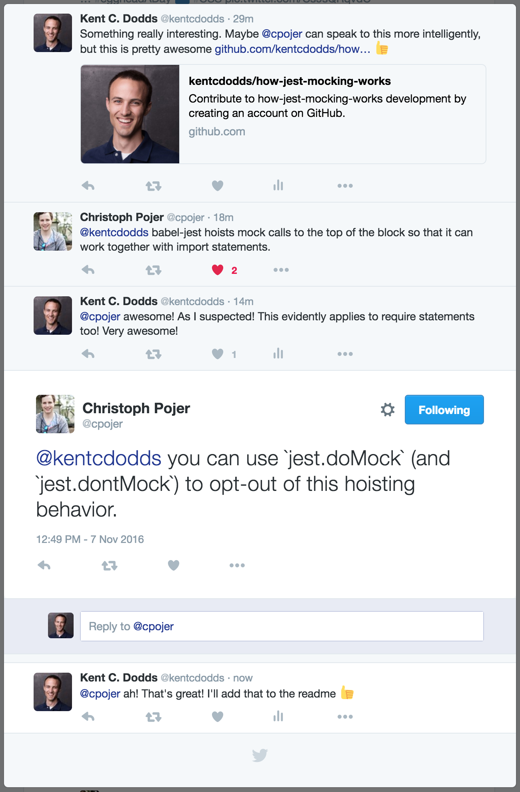

# How Jest Mocking Works

This title is a bit misleading. I'm not explaining everything about Jest mocking, just something I wanted to test out
and thought was kind of interesting. So it turns out that if you make a call to `jest.mock` in the root of your module,
that mocking will take place before any require statements are resolved/run. This actually makes Jest's mocking
capabilities really powerful! It essentially means that you can import all the stuff you would normally, and not worry
about whether you're mocking things in time. Pretty legit!

And Christoph [comes in](https://twitter.com/cpojer/status/795729860819820544) to give a little more insight here :)
Looks like you can use `jest.doMock` or `jest.dontMock` to change this behavior.

